# 🛣️ SafeRoute — Smart Road-Trip Planner & Ride Platform

> **Full project documentation & report.** Everything in this file: what the app does, a screenshot tour of every screen (desktop **and** mobile, captured with Playwright from the real running app), what every option on every page is for, how to run it on any PC, the database, the free APIs, the PWA, and troubleshooting.

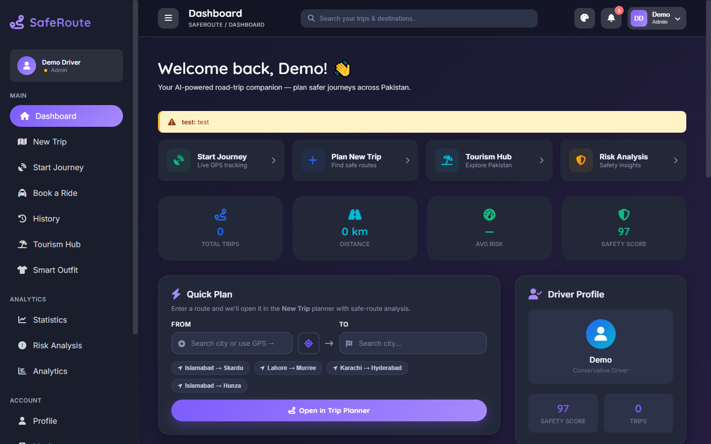

SafeRoute is a **full-stack travel platform**: plan road trips on **real driving routes** with automatic **safety-risk scoring**, run **live GPS journeys** with voice guidance, book rides in a **customer/driver marketplace**, explore **any city in the world** with real photos, get **AI outfit advice** from live weather, and manage it all from a powerful **admin panel** — wrapped in a modern dark-violet UI that installs as a **PWA** on your phone.

---

## 📚 Table of Contents

1. [Quick Start (run on any PC)](#-quick-start--run-on-any-pc)
2. [Screenshot Tour — every screen explained](#-screenshot-tour--every-screen-explained)
3. [Mobile Experience](#-mobile-experience)
4. [PWA — install it like a real app](#-pwa--install-it-like-a-real-app)
5. [Every Page & Option Reference](#-every-page--option-reference)
6. [Tech Stack & Free APIs](#-tech-stack--free-apis)
7. [Database (Supabase)](#-database-supabase)
8. [Admin Guide](#-admin-guide)
9. [Project Structure](#-project-structure)
10. [Scripts](#-scripts)
11. [Deploying to the Internet](#-deploying-to-the-internet)
12. [Troubleshooting](#-troubleshooting)
13. [Security Notes](#-security-notes)

---

## 🚀 Quick Start — run on any PC

This zip **includes the `.env` file**, so the app is pre-connected to its Supabase backend. You only need **Node.js**.

1. **Install Node.js 18+** → <https://nodejs.org> (LTS). Verify: `node -v`
2. **Unzip** this project anywhere.
3. **Double-click `start.bat`** (Windows) or run `./start.sh` (Mac/Linux).
   It installs dependencies on first run and starts the app automatically.
   *Manual way:* `npm install` then `npm run dev`.
4. Open the printed URL (usually **http://localhost:5173**).
5. **Register** an account → confirm the email Supabase sends → **Sign in**. Done.

> 💡 The database schema is already applied to the connected Supabase project. If you ever connect a **fresh** Supabase project, run `supabase/schema.sql` in its SQL Editor first (it's idempotent — safe to re-run anytime).

---

## 📸 Screenshot Tour — every screen explained

*All screenshots below were captured with **Playwright** from the real running app (viewport 1440×900 desktop, 390×844 mobile).*

### 🔐 Login
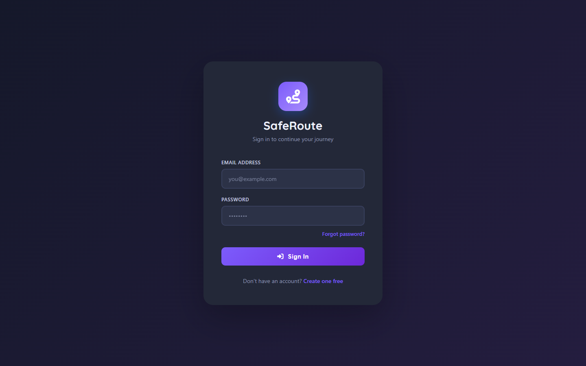
Email + password sign-in (Supabase Auth). **Forgot password?** sends a real reset email. **Create one free** → registration with name, email, password + confirmation. New signups automatically get a profile and settings row via a database trigger.

### 🏠 Dashboard — your command center

- **Admin broadcast banner** (the yellow strip) — announcements published from the Admin Panel appear here for every user.
- **Quick-action tiles** — jump to Start Journey, New Trip, Tourism, Risk Analysis.
- **Live KPIs** — total trips, distance, average risk, safety score, all from your saved data.
- **Quick Plan** — type From/To with **real city autocomplete** (or tap the GPS button), or use a popular-route chip → opens the New Trip planner and runs the analysis automatically.
- **Recent Trips**, **Driver Profile**, **live Weather** (with what-to-wear advice + link to Smart Outfit), **Risk Distribution donut**, **6-month Activity chart**, **latest-trip route drawn on the map**, **Tourism highlights** with real photos, and **Live Hazards** derived from real weather.

### 🗺️ New Trip — plan with real routes
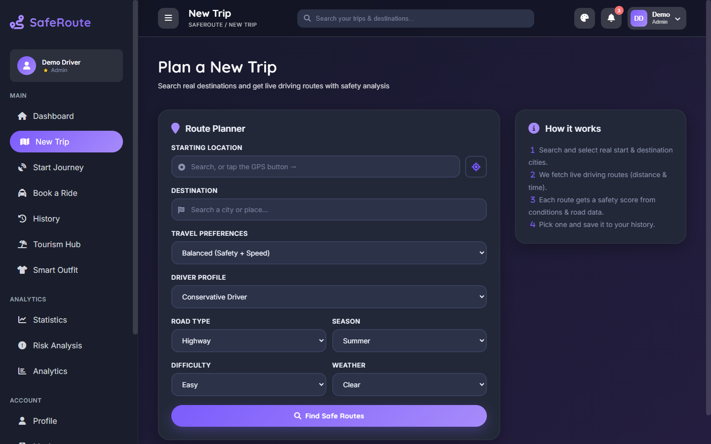
Search **real cities** (Open-Meteo geocoding autocomplete, GPS button for your position). Set preferences: travel style, driver profile, road type, season, difficulty, weather. **Find Safe Routes** fetches up to **3 real driving routes from OSRM** (true distance, duration, geometry drawn on the map — selected route solid, alternatives dashed). Each route gets a **risk score** computed from real speed/distance plus your conditions, and a traffic label from actual average speed. Then **Save to History** or **Start Live Journey**.

### 🛰️ Live Journey — GPS trip mode
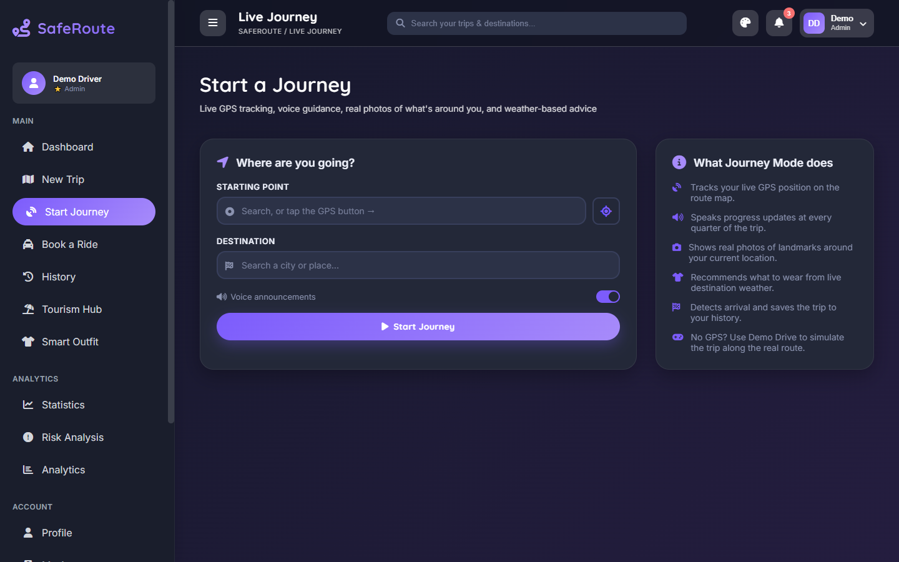
Pick a start (GPS button) and destination → **Start Journey** opens a **split screen**: live map with a pulsing you-are-here marker following your real GPS, and a panel with progress bar, km remaining, live speed, ETA, elapsed time, **voice announcements** (start, every 25%, arrival — mutable), **weather + outfit advice for your destination**, and **real photos of landmarks around your current position** that refresh as you move. Arrival is detected automatically and the trip saves to History. No GPS on a desktop? **Demo Drive** simulates driving along the real route.

### 🚕 Rides — customer & driver marketplace
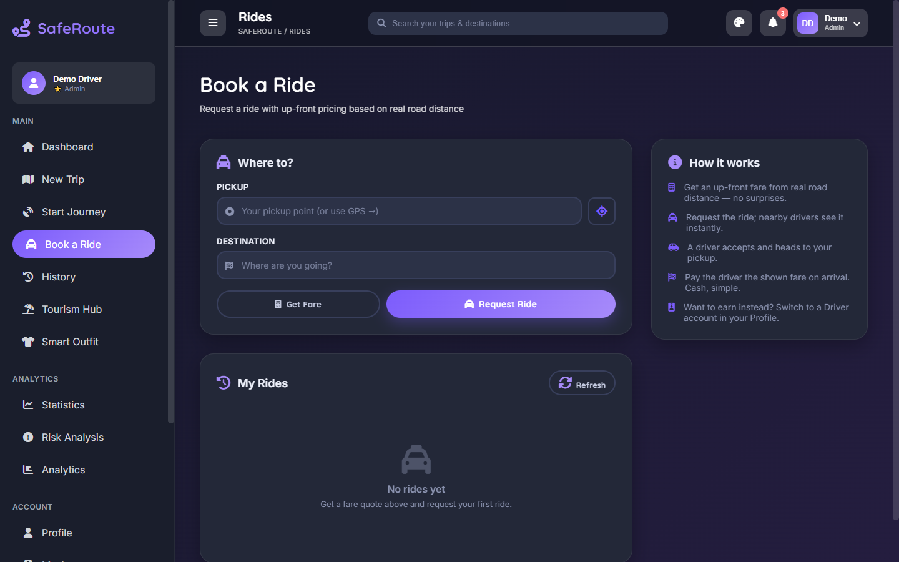
Real two-sided ride system, like ride-hailing apps:
- **Customers**: pickup (GPS) + destination → **Get Fare** shows an **up-front price from real road distance** (Rs. 200 base + Rs. 45/km) with ETA → **Request Ride** → live status: *Finding driver → Driver on the way → Completed*, with cancel.
- **Drivers** (switch in Profile → Account Type): earnings dashboard, **incoming request feed** with Accept (race-safe), Complete rides to earn. The sidebar renames itself *Book a Ride* ↔ *Driver Hub* based on your account type.

### 🏔️ Tourism Hub — explore any city on Earth
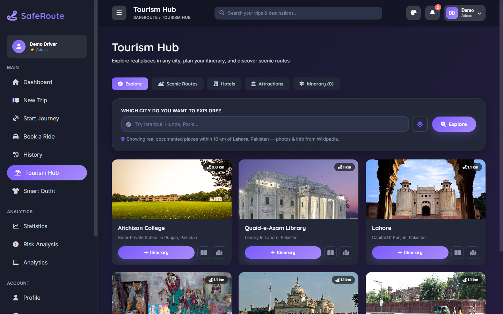
- **Explore** — search **any city worldwide** → real documented places within 10 km, each with a **real photo**, description, **distance from center**, Wikipedia link, open-in-maps, and Add to Itinerary.
- **Scenic Routes / Hotels / Attractions** — curated Pakistani picks with real photos; scenic routes have full detail pages.
- **Itinerary** — persistent day plan: numbered stops, durations, Optimize, Clear, total-hours summary. Saved automatically.

### 👕 Smart Outfit — ML weather classifier + your closet
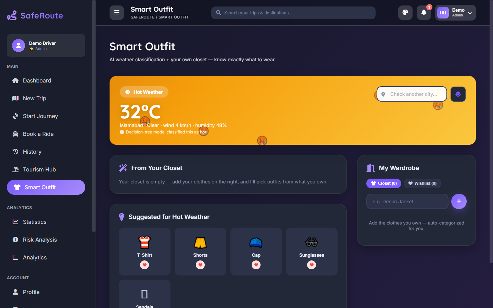
A decision-tree model (ported from a Python/scikit-learn project) classifies live weather into **Cold / Mild / Hot / Rainy** — the animated hero banner changes its gradient and floating emojis per category. It recommends outfits **from your own closet** first, then generic suggestions. Manage your **Closet & Wishlist**: add items (auto-categorized + emoji), move wishlist→closet, all saved per user. Check any city, or use GPS.

### 👑 Subscription — Free / Pro / Fleet
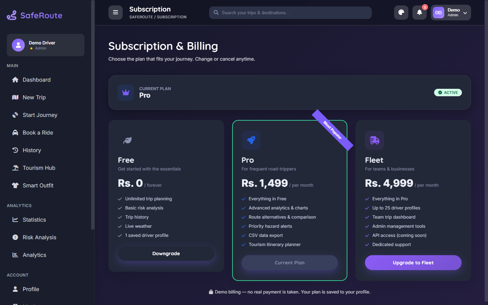
Three plans with feature lists and up-front pricing. Free keeps all core planning; **Pro** unlocks CSV export & advanced extras; **Fleet** targets teams. Choosing a plan saves to your profile (demo billing — no real charge) and feeds the **Admin Revenue dashboard**. Free users hitting a Pro feature (e.g. CSV export) get a friendly upgrade prompt.

### 🛡️ Admin Panel — run the whole platform
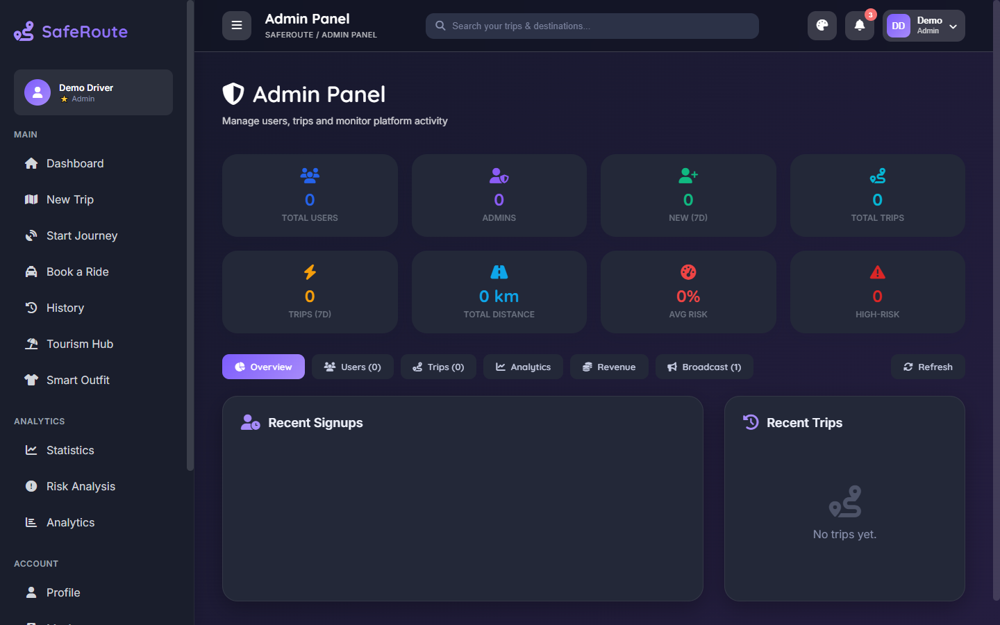
Six tabs (admin accounts only): **Overview** (recent signups/trips), **Users** (search/filter/sort/paginate, edit role·plan·safety score, drill-down per user, delete user data, CSV), **Trips** (moderate all trips), **Analytics** (signup & trip charts, platform risk donut, top destinations), **Revenue** (MRR, annual run-rate, conversion %, plan donut, subscriber list), **Broadcast** (publish announcements typed info/success/warning/danger → they appear on every user's dashboard + notification bell; hide or delete anytime). Eight KPI cards on top.

### ⚠️ Risk Analysis
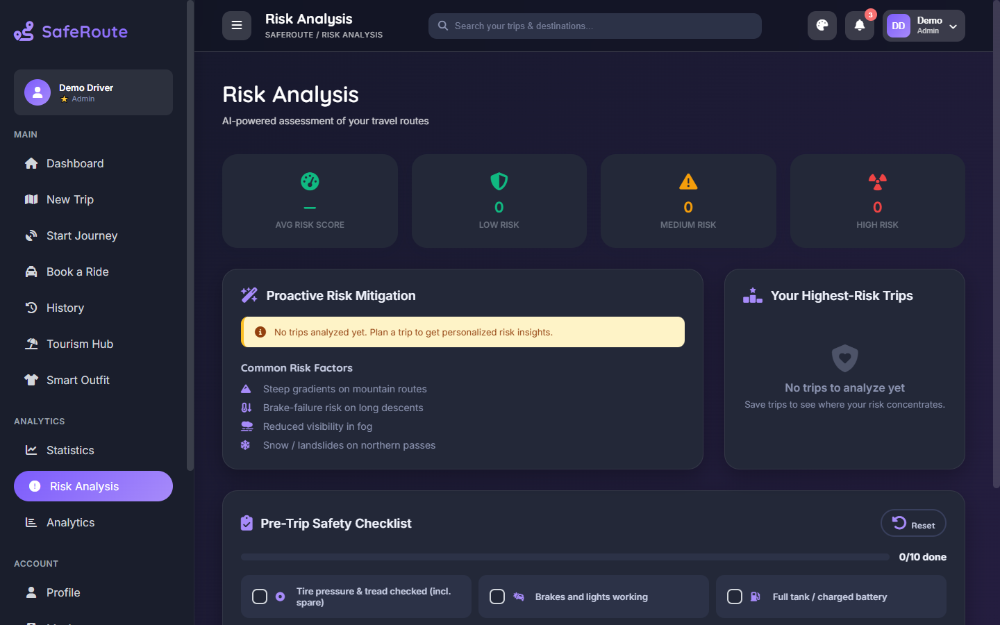
Your risk mix (donut), 6-month risk trend, highest-risk trips ranked with bars, personalized recommendations from your own data — plus an interactive **Pre-Trip Safety Checklist** (10 practical checks, progress bar goes green on 10/10, persisted).

### Also in the app (not pictured)
**History** — searchable/sortable trip table, edit status & notes, **view any trip's route on a map**, Plan Again, Start Journey, CSV export (Pro), confirm-delete. **Statistics & Analytics** — distance/hours/cities, efficiency score, monthly charts, top destinations. **Profile** — personal details, emergency contact, vehicle, **Customer/Driver account type**. **My Account** — overview + plan card. **Settings** — language/units, notification toggles, **theme picker (5 dark themes) + compact density**, change password, export my data (JSON), delete account. **404 page** for wrong turns.

---

## 📱 Mobile Experience

Fully responsive, captured at 390×844:

| Dashboard on mobile | Collapsible drawer menu | Smart Outfit on mobile |
|---|---|---|
| 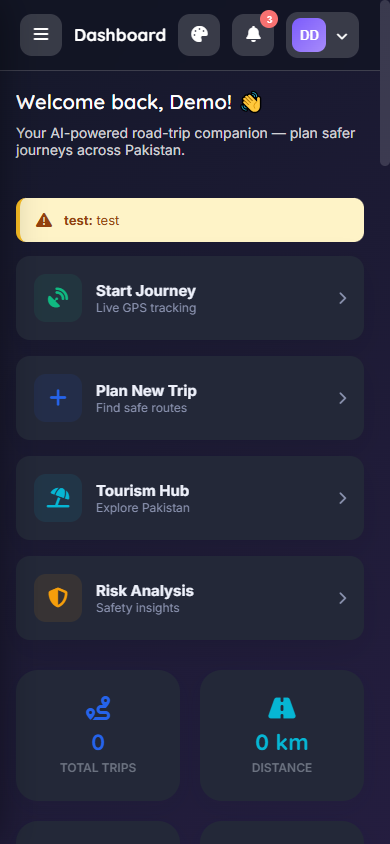 | 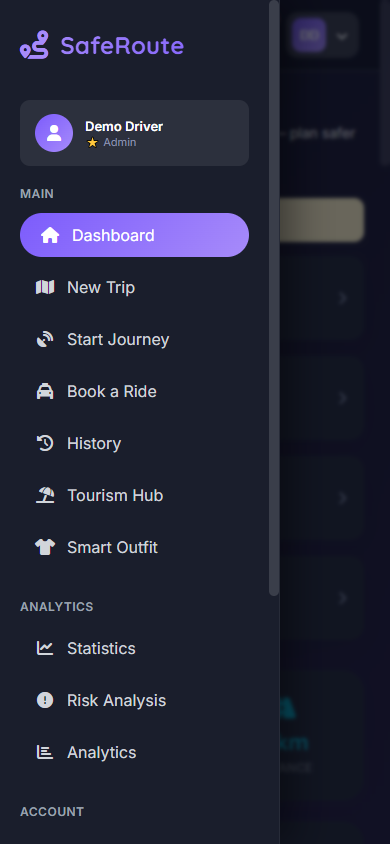 | 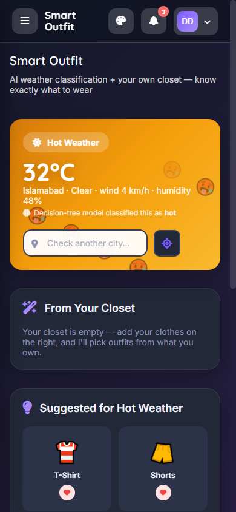 |

- The **sidebar becomes an off-canvas drawer** — hidden by default, opened with the ☰ button in the topbar, slides over the content with a blurred backdrop, closes on backdrop tap or navigation. On desktop the same ☰ collapses the sidebar to an icon rail for more workspace.
- All grids reflow (4→2→1 columns), tables scroll horizontally, the journey split-screen stacks map-over-panel, modals fit the screen, and touch targets stay comfortable.

---

## 📲 PWA — install it like a real app

SafeRoute is a **Progressive Web App**:

- **Install it**: open the site in Chrome/Edge → click the **Install** icon in the address bar (desktop), or menu → **Add to Home Screen** (Android), or Share → **Add to Home Screen** (iOS Safari). It launches standalone — no browser chrome — with its own violet icon and splash.
- **App shortcuts**: long-press the installed icon → jump straight to *Start Journey* or *Plan New Trip*.
- **Offline app shell**: a service worker (`public/sw.js`) caches the app shell, so the UI loads even offline (live data like routes/weather still needs a connection — API calls are deliberately never cached so data stays fresh).
- Configured via `public/manifest.webmanifest` (name, icons 192/512, `display: standalone`, theme color `#7c5cfc`); the worker registers only in production builds so it never interferes with development.
- **Requirements**: PWA install + GPS need **HTTPS or localhost**. When you deploy (see below), both work automatically.

---

## 🧭 Every Page & Option Reference

| Page (route) | What it's for | Key options |
|---|---|---|
| **Login** `/login` | Sign in | Email, password, forgot-password reset email, link to register |
| **Register** `/register` | Create account | Name, email, password ×2 (min 6 chars) |
| **Dashboard** `/` | Overview & quick actions | Quick Plan (autocomplete + GPS), popular-route chips, KPIs, recent trips, weather + outfit link, charts, map, tourism tiles, hazards, admin broadcasts |
| **New Trip** `/new-trip` | Route planning | City autocomplete ×2, GPS start, 6 preference selects, Find Safe Routes, route cards (time/km/risk/traffic), map with alternatives, Save to History, Start Live Journey |
| **Start Journey** `/journey` | Live GPS trip | GPS start, voice toggle, Start Journey, split-screen live map, progress/speed/ETA, photos around you, outfit for destination, Demo Drive, End & Save |
| **Rides** `/rides` | Ride marketplace | *Customer:* pickup/destination, Get Fare, Request, cancel. *Driver:* Accept, Complete, earnings KPIs, Refresh |
| **History** `/history` | Trip records | Search, risk filter chips, sortable columns, view-route modal (map + Plan Again + Start Journey), edit status/notes, delete, CSV export (Pro) |
| **Tourism** `/tourism` | Explore & plan visits | Explore-any-city search, place cards (photo/distance/wiki/maps), Scenic/Hotels/Attractions tabs, persistent Itinerary (add/remove/optimize/clear) |
| **Smart Outfit** `/outfit` | What to wear | Animated category hero, city search + GPS, closet matches, suggestions, Closet/Wishlist manager |
| **Statistics** `/statistics` | Your numbers | Distance/hours/cities/trips, risk breakdown bars, recent activity |
| **Risk Analysis** `/risk-analysis` | Safety insights | Risk KPIs, donut + trend charts, riskiest trips, recommendations, pre-trip checklist |
| **Analytics** `/analytics` | Behavior trends | Trips/month, efficiency score, risk trend, top destinations |
| **Profile** `/profile` | Your identity | Name/email/phone, emergency contact, vehicle + plate, **Customer/Driver switch** |
| **My Account** `/account` | Account overview | Usage stats, account details, plan card → Manage Plan, quick links, sign out |
| **Subscription** `/subscription` | Plans | Free/Pro/Fleet cards, upgrade/downgrade with confirm |
| **Settings** `/settings` | Preferences | Language, units, notification toggles, **theme picker + density**, change password, download my data, delete account, sign out |
| **Admin** `/admin` | Platform control | Overview / Users / Trips / Analytics / Revenue / Broadcast (admins only) |
| **Topbar** (everywhere) | Global chrome | ☰ sidebar toggle, page title, global trip search, 🎨 theme menu, 🔔 notifications (broadcasts + trip alerts), user menu |

---

## 🧰 Tech Stack & Free APIs

**Frontend:** React 19 · Vite 7 · React Router 7 · Leaflet/React-Leaflet · Font Awesome · Inter + Quicksand fonts
**Backend:** Supabase (PostgreSQL + Auth + Row-Level Security) — connected via `.env`
**Quality:** ESLint 9 · Playwright MCP (used to capture the screenshots in this doc)

**Free APIs (no keys, already wired):**

| Purpose | Service |
|---|---|
| City search & geocoding | Open-Meteo Geocoding |
| Live weather + forecast | Open-Meteo Forecast |
| Real driving routes | OSRM (2 public hosts + offline estimate fallback) |
| Map tiles | OpenStreetMap |
| Place photos & nearby landmarks | Wikipedia REST + geosearch APIs |
| GPS → place name | BigDataCloud reverse geocoding |
| Voice guidance | Browser SpeechSynthesis |
| Live position | Browser Geolocation API |

---

## 🗄️ Database (Supabase)

All in [`supabase/schema.sql`](supabase/schema.sql) — idempotent, run it whole in the SQL Editor for any new project.

| Table | Purpose |
|---|---|
| `profiles` | Extends auth users: name, phone, vehicle, emergency contact, `role` (user/admin), `plan` (Free/Pro/Fleet), `user_type` (customer/driver), safety score |
| `trips` | Saved trips: locations, distance, duration, risk score/level, status, notes |
| `user_settings` | Preferences & notification toggles |
| `announcements` | Admin broadcasts (title, message, type, active) |
| `rides` | Marketplace: customer, driver, pickup/destination, distance, fare, status |

**Row-Level Security everywhere**: users only see their own data; open ride requests are visible to signed-in users so drivers can accept; admins (via a recursion-safe `is_admin()` function) manage everything. A signup trigger auto-creates each user's profile + settings.

---

## 🛡️ Admin Guide

1. Register normally, then in Supabase → **Table Editor → profiles** → set your row's `role` to `admin`.
2. Refresh the app → **Admin Panel** appears in the sidebar.
3. From there you can: manage every user (role, plan, safety score, delete), moderate all trips, watch platform analytics & **revenue** (MRR from Pro/Fleet plans), and **broadcast announcements** to all users' dashboards & notification bells.

---

## 🗂️ Project Structure

```
saferoute/
├─ start.bat / start.sh        # one-click run (install + dev server)
├─ .env                        # Supabase connection (INCLUDED in this package)
├─ .mcp.json                   # Playwright MCP for browser automation in Claude Code
├─ index.html                  # fonts, manifest, meta
├─ public/
│  ├─ manifest.webmanifest     # PWA manifest (icons, shortcuts, theme)
│  ├─ sw.js                    # service worker (offline app shell)
│  └─ icons/                   # app icons (192/512)
├─ supabase/schema.sql         # full database schema + RLS (idempotent)
├─ docs/screenshots/           # all screenshots used in this README
└─ src/
   ├─ context/                 # Auth (incl. dev demo mode), Theme, Toast providers
   ├─ lib/supabase.js          # Supabase client
   ├─ components/              # Topbar, Sidebar, RouteMap, LocationInput, Charts,
   │                           # Modal/Confirm, PlaceImage, Weather, Tourism cards...
   ├─ pages/                   # 19 routed pages (see reference table above)
   ├─ styles/                  # variables (design tokens) / components / animations / responsive
   └─ utils/                   # geo (routing+GPS), weather (+outfit advice), photos,
                               # outfitModel (ML port), csv, helpers, tourismAPI
```

---

## 📦 Scripts

| Command | What it does |
|---|---|
| `start.bat` / `./start.sh` | Install (first run) + start dev server |
| `npm run dev` | Dev server with hot reload |
| `npm run build` | Production build → `dist/` |
| `npm run preview` | Serve the production build locally |
| `npm run lint` | ESLint |

**Dev demo mode** (browse the UI without signing in — used for these screenshots): open DevTools console → `localStorage.setItem('sr_demo','1')` → refresh. Remove with `localStorage.removeItem('sr_demo')`. Dev-only; production builds ignore it.

---

## 🌐 Deploying to the Internet

1. Push to GitHub → import in **Vercel** or **Netlify**.
2. Build command `npm run build`, output `dist`.
3. Add env vars `VITE_SUPABASE_URL` + `VITE_SUPABASE_ANON_KEY` in the host dashboard.
4. In Supabase → Authentication → URL Configuration → set your deployed URL (so email links work).
5. Done — HTTPS enables PWA install + GPS automatically.

---

## 🛠️ Troubleshooting

| Problem | Fix |
|---|---|
| Blank page / "supabaseUrl is required" | `.env` missing — it's included in this zip; make sure it's next to `package.json`, then restart `npm run dev` |
| Can't log in after registering | Email confirmation is ON — click the link Supabase emailed you, then sign in |
| "column plan / user_type does not exist" or rides/announcements errors | Connected a fresh Supabase project — run all of `supabase/schema.sql` in its SQL Editor |
| Routes say "estimated" | Public OSRM was unreachable; app fell back to a straight-line estimate from real coordinates — retry later |
| GPS button does nothing | Allow location permission; GPS needs HTTPS or localhost |
| No photos for a place | It has no documented Wikipedia imagery — a placeholder is shown |
| Admin Panel missing | Set `profiles.role = 'admin'` for your user in Supabase, refresh |
| PWA install icon missing | Use Chrome/Edge on HTTPS/localhost; visit a couple of pages first |
| Port 5173 busy | Vite auto-picks the next port — read the terminal for the URL |

---

## 🔒 Security Notes

- This package **includes `.env`** on purpose so it runs instantly on your other PC. The `anon` key inside is designed to be public *for browser apps* — all real protection is enforced by **Row-Level Security** in the database. Still, **don't publish this zip or the repo publicly with `.env` inside** (`.gitignore` already excludes it from git).
- Never put the Supabase **service_role** key in this project.
- Subscription billing is a **demo** — plans are saved, no money moves.

---

*Documentation generated with the app running — screenshots captured live via Playwright browser automation. Made with ❤️ for safer roads.*
